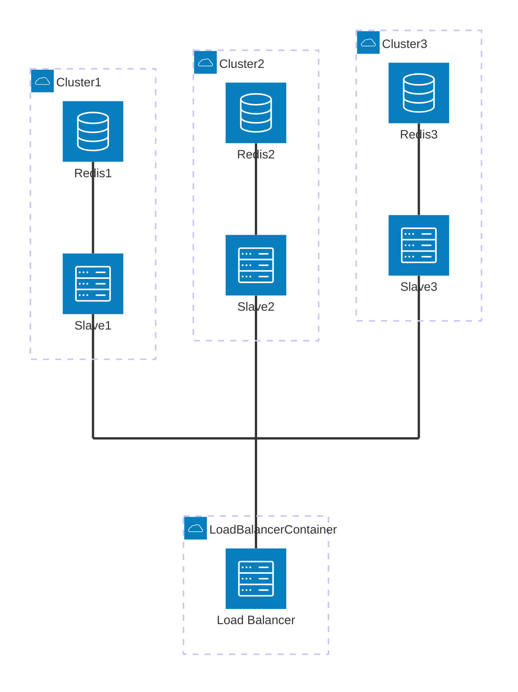

# Q1-Q2 - Docker config + Scale up (5 + 5 points)

**Objective:** Set up a containerized environment with a working **load balancer** and **clusters** (consult-db-slave + Redis) (Q1), then make the number of instances **easily adjustable** (Q2).

## Instructions

### Q1 - Docker config

- Fix and build the image containing Redis and the TypeScript server (consult-db-slave).
- Build the load balancer image and allow access to resources through it.
- Set up networking via `docker-compose` **without** using `host` mode.
- Start the environment using a script and expose the resources through the load balancer (using docker-compose is allowed).

### Q2 - Scale up

- Make the number of containers easily configurable (example: `./launch-env 5`).
- Support dynamic assignment of IPs/URLs/domains if needed.
- Otherwise, provide a clear procedure explaining how to change the scale.

## Expected deliverables

### Q1 - Docker config

- Build script (e.g. `.ps1` or `.sh`).
- Startup script (e.g. `.ps1` or `.sh`) that launches the environment (both scripts may be combined).
- `docker-compose.yml` and Dockerfiles adjusted if necessary.
- Any other required configuration file changes.

### Q2 - Scale up

- The startup script accepts a scale parameter (e.g. `./launch-env 5`).
- A short scaling procedure if scaling is not fully automated.

## Technical constraints

- Using Docker’s `host` network mode is forbidden.
- You do not need to handle runtime logic (e.g. restarting a failed cluster), only configuration and scaling.

## Expected architecture

Here is the architecture you are given and what is expected once it is fixed:

- **1 container** running the application that distributes tasks (load balancer).
- **2 or more "duplicated" containers** accepting read/write tasks against a cache (consult-db-slave).
- Each container has its own Redis cache, but only one cache is used at a time (see the "Redis leader" election logic implemented in the load balancer / consult-db-slave).

## Hints

### Configuration files

- To get started, briefly examine the `index.ts` file, especially the first 30 lines. They contain hints about what needs to be configured in Docker (and possibly in the `my-deployments-config.json` files as well).

### Run tests

- Check whether the API works normally with commands like `list-keys`, `get`, `set`, etc. (see #Routes).
- Stop one of the clusters. The system should remain "healthy" even if the whole system is not fully functional.
- Verify that your scaling method works.

## Considerations

- Protocol error-handling logic does not need to be changed, except for how lists of IPs/domains are extracted.
- If a particular cluster is stopped, its data is lost (no data replication). An election should be triggered after X failures among the remaining clusters.

## Resources

- Docker Compose: https://docs.docker.com/compose/
- Redis: https://redis.io/docs/latest/

## Deployment graph

Use this graph to understand the load balancing architecture.  
Some connections need to be created and are not shown in the graph, especially connections between "Slaves" and Redis instances in other clusters (for example, the connection between Slave1 and Redis3).

(If you use VS Code to visualize this graph, an extension is available: [Mermaid Extension](https://marketplace.visualstudio.com/items?itemName=bierner.markdown-mermaid))  
(GitHub natively supports Mermaid diagrams.)

## Evaluation criteria

| Criterion              | Points | Description                                                                              |
| ---------------------- | -----: | ---------------------------------------------------------------------------------------- |
| **Q1 — Docker config** |      5 | Images + `docker-compose` (without `host`) + scripted startup + access via load balancer |
| **Q2 — Scale up**      |      5 | Simple scaling (parameter) + dynamic addressing + clear procedure if needed              |
| **Total**              | **10** |                                                                                          |
